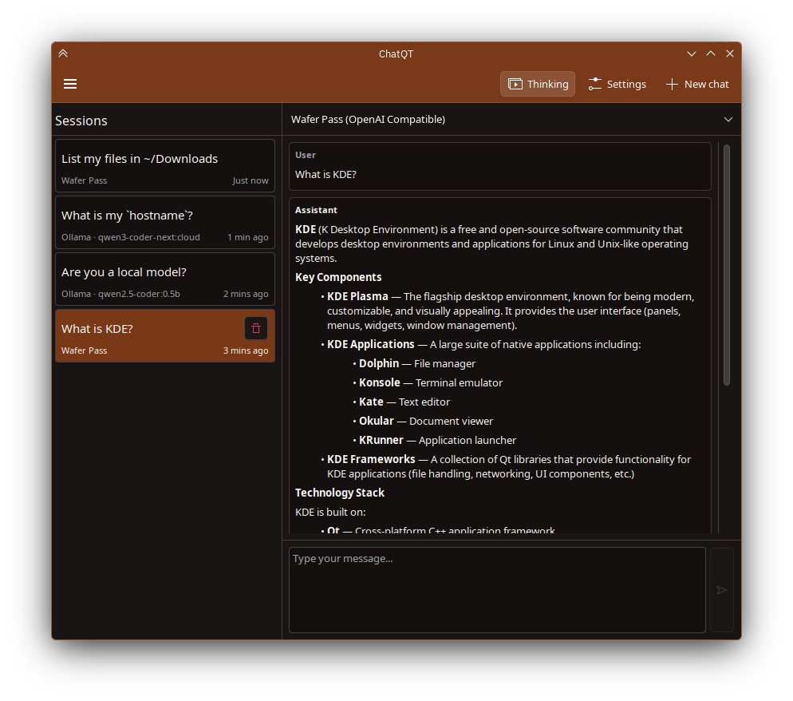
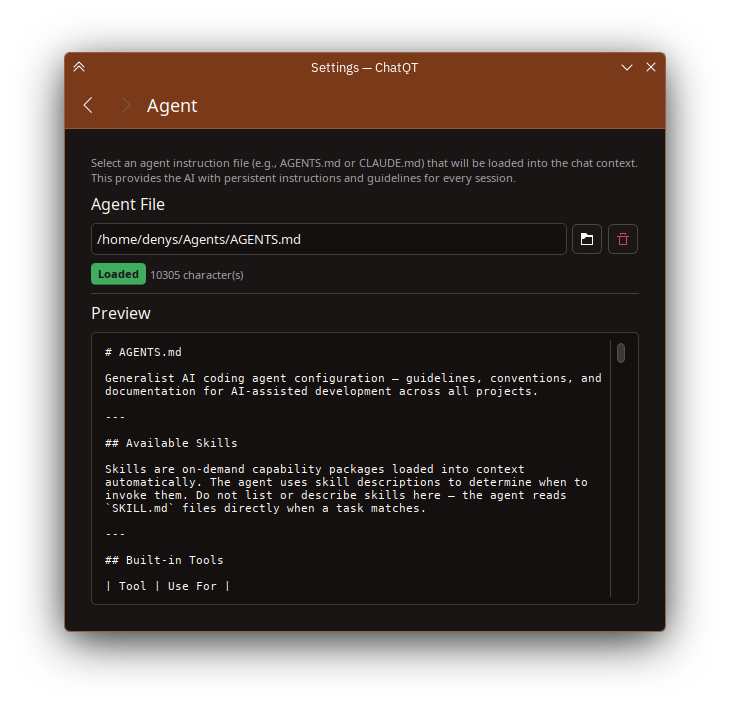
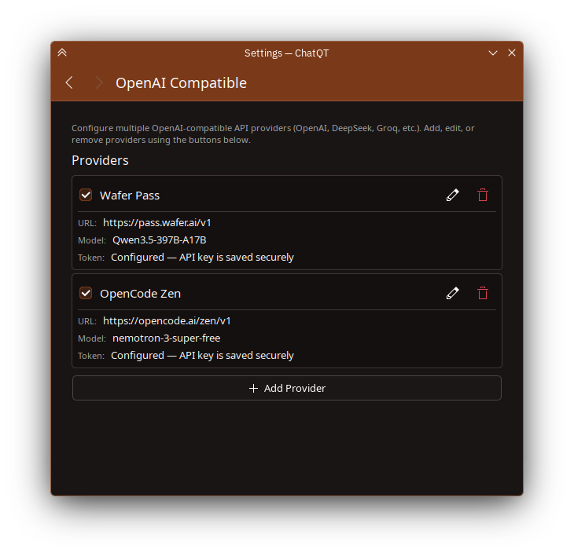
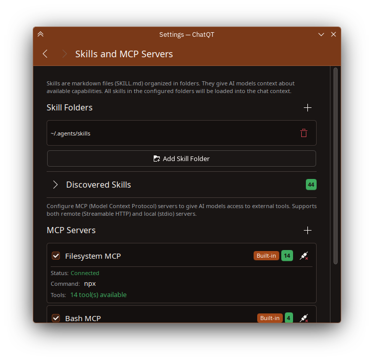

<div align="center">
  

  # ChatQT

  **A native AI chat client for the KDE Plasma desktop**

  Chat with AI models through multiple providers — directly from your desktop

</div>

---

## About

ChatQT is a native KDE Plasma application for chatting with AI models. Built with Qt6/QML and Kirigami, it integrates seamlessly into the KDE desktop with a system tray icon, native look and feel, and Plasma-style dialogs.

## Features

### Providers

- **Ollama** — Connect to local models running via Ollama with automatic model discovery
- **OpenAI Compatible** — Connect to any OpenAI-compatible API (OpenAI, DeepSeek, Groq, etc.) with multi-provider support and connection testing
- **OpenClaw** — Connect to OpenClaw instances with multi-instance support (experimental)
- **OpenCode** — Built-in OpenCode server management with start/stop/restart controls and auto-start (experimental)
- **Pi** — Built-in Pi process management via RPC mode with auto-detect and auto-start (experimental)

### Chat

- **Streaming responses** — Real-time token-by-token response display
- **Thinking mode** — Toggle extended thinking/reasoning for supported models
- **Session management** — Persistent sessions with sidebar, auto-restore on launch
- **Cancel and stop** — Cancel pending requests or stop mid-stream
- **Auto-scroll** — Automatic scrolling with manual override option

### MCP (Model Context Protocol)

- **Remote MCP servers** — Connect to Streamable HTTP MCP servers
- **Local MCP servers** — Run stdio-based MCP servers as subprocesses (JSON-RPC)
- **Built-in servers** — Pre-configured Bash MCP and Filesystem MCP servers
- **Tool calling** — Automatic tool call detection, execution, and follow-up with configurable depth limit
- **Server status** — Real-time connection status and available tool count

### Skills and Agent

- **Skill discovery** — Scan folders for `SKILL.md` files and inject them into chat context as system prompts
- **Agent instructions** — Load an `AGENTS.md` or `CLAUDE.md` file to provide persistent AI instructions
- **System prompt builder** — Automatically combines skills and agent instructions into a system message

### Desktop Integration

- **System tray** — Minimizes to system tray, click to toggle visibility
- **Flatpak support** — Available as a Flatpak with proper sandboxing utilities

## Screenshots

### Main Window



### Settings — Agent



### Settings — OpenAI Compatible



### Settings — Skills and MCP Servers



## Installation

### Building from Source

For build instructions, see [BUILD.md](BUILD.md).

### Flatpak

A Flatpak manifest is available at `org.koderoots.chatqt.json`.

## Experimental Features

ChatQT includes experimental features that are disabled by default. These features are functional but may have rough edges, change between releases, or lack full polish.

### Enabling Experimental Features

Set the environment variable before launching:

```bash
CHATQT_ENABLE_EXPERIMENTAL_FEATURES=1 chatqt
```

Or for development builds:

```bash
CHATQT_ENABLE_EXPERIMENTAL_FEATURES=1 ./build/bin/chatqt
```

Once enabled, new provider options appear in **Settings → General**.

### Experimental Providers

| Provider | Description |
|----------|-------------|
| **OpenClaw** | Connect to OpenClaw agent instances. Supports multiple instances with URL/token configuration and connection testing. Requires the OpenAI-compatible Chat Completions endpoint enabled in OpenClaw. |
| **OpenCode** | Manages an OpenCode server process directly from ChatQT. Configure the binary path, auto-detect, start/stop/restart, set host/port, and view server logs. Supports auto-start on launch and auto-restart on crash (up to 3 attempts). |
| **Pi** | Connects to a Pi coding agent via RPC mode (stdin/stdout JSONL protocol). Configure the binary path, auto-detect, start/stop, and view logs. Supports auto-start when Pi is the active provider. |

## License

This project is licensed under the GPL-3.0 License - see the LICENSE file for details.
